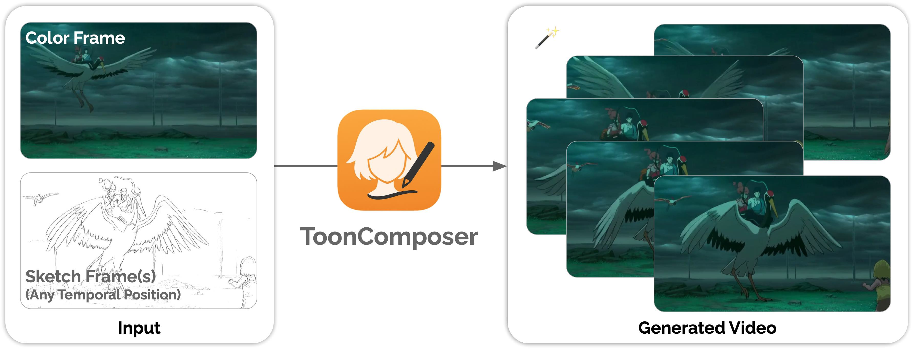
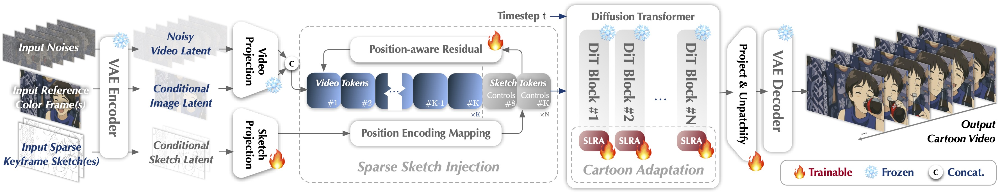

# ToonComposer

<div align="center">

</div>

<p align="center"> <b> ToonComposer: Streamlining Cartoon Production with Generative Post-Keyframing </b> </p>

<p align="center"> Lingen Li, Guangzhi Wang, Zhaoyang Zhang, Yaowei Li, Xiaoyu Li, Qi Dou, Jinwei Gu, Tianfan Xue, Ying Shan </p>

<p align="center"> <a href='https://lg-li.github.io/project/tooncomposer'></a> &nbsp;
 <a href='https://huggingface.co/TencentARC/ToonComposer'></a> &nbsp;
 <a href='https://huggingface.co/spaces/TencentARC/ToonComposer'></a>
 <a href="https://arxiv.org/abs/2508.10881"></a>
</p>

## 👀 TL;DR

<div align="center">

</div>

Traditional cartoon/anime production is time-consuming, requiring skilled artists for keyframing, inbetweening, and colorization.
ToonComposer streamlines this with generative AI, turning hours of manual work of inbetweening and colorization into a single, seamless process. Visit our [project page](https://lg-li.github.io/project/tooncomposer) and read our [paper](https://arxiv.org/abs/2508.10881) for more details.

<div align="center">

</div>

## ✏️ Updates

[08/18/2025] Online gradio demo is now available on [Hugging Face Space](https://huggingface.co/spaces/TencentARC/ToonComposer).

[08/15/2025] ToonComposer model weights are available [here](https://huggingface.co/TencentARC/ToonComposer).

## ⚠️ Unauthorized Site Notice

The website https://tooncomposer.com is <b>NOT</b> hosted, authorized, or endorsed by the ToonComposer team. This site has replicated content from our open-source project without our permission or notification, and we are unaware of the operators’ identity or intentions.

## ⚙️ Configuration

### 1) Clone the repository

```bash
git clone https://github.com/TencentARC/ToonComposer
cd ToonComposer
```

### 2) Set up the Python environment

Create a conda environment and install dependencies from requirements.txt.

```bash
conda create -n tooncomposer python=3.10 -y
conda activate tooncomposer
pip install -r requirements.txt
```

**Note: ToonComposer requires specific versions for gradio==5.25.2.**

For Linux users, we recommend installing `flash_attn`.

```bash
pip install flash-attn==2.8.2 --no-build-isolation
```


### 3) Run the app

The app will check your local cache and download required weights if missing (see Weights section below). By default, the Gradio interface launches on port 7860.

```bash
python app.py
```

Open your browser at `http://localhost:7860`.

If you run on a remote server, replace `localhost` with your server IP or hostname.

Generating a 480p video with 61 frames requires ~57GB of VRAM. If you don't have sufficient GPU resources, we recommend trying our [🤗 Hugging Face Spaces demo](https://huggingface.co/spaces/TencentARC/ToonComposer) instead.

## 💾 Weights and Checkpoints

ToonComposer relies on two sets of weights:

- **Wan2.1 I2V 14B 480P (foundation model)**: `Wan-AI/Wan2.1-I2V-14B-480P`
- **ToonComposer weights**: `TencentARC/ToonComposer`

The app resolves weights in this order:

- If you provide local directories via CLI flags or environment variables (see below), they are used first.
- Otherwise, it checks your local Hugging Face cache (no network).
- If still not found, it downloads from the Hugging Face Hub.

Because Wan2.1 is very large, the app avoids re-downloading if it exists in your cache.

### Provide local directories (optional)

- Environment variables:
  - `WAN21_I2V_DIR`: path to local Wan2.1 model directory
  - `TOONCOMPOSER_DIR`: path to local ToonComposer directory that contains `480p/` and/or `608p/` subdirectories. Each subdir should include `tooncomposer.ckpt` and `config.json`.
  - `HF_TOKEN`: HF access token if required for gated downloads (optional)

```bash
export WAN21_I2V_DIR=/abs/path/to/Wan2.1-I2V-14B-480P
export TOONCOMPOSER_DIR=/abs/path/to/TencentARC-ToonComposer
export HF_TOKEN=hf_xxx  # optional
python app.py
```

- CLI flags (override env vars):

```bash
python app.py \
  --wan_model_dir /abs/path/to/Wan2.1-I2V-14B-480P \
  --tooncomposer_dir /abs/path/to/TencentARC-ToonComposer \
  --hf_token hf_xxx \
  --resolution 480p \
  --device cuda:0
```

Notes:

- The ToonComposer HF repo organizes weights by resolution: `480p/` and `608p/`. The app automatically loads the correct `config.json` and `tooncomposer.ckpt` from the selected resolution directory.
- The app checks the HF cache first (`local_files_only=True`) and only downloads if missing.

## 📖 Usage Guide

### Launch options

```bash
python app.py --help
```

- **--resolution**: `480p` or `608p` (default: `480p`)
- **--device**: e.g., `cuda:0`, `cpu` (default: `cuda:0`)
- **--wan_model_dir**: local Wan2.1 directory (optional)
- **--tooncomposer_dir**: local ToonComposer directory with `480p/608p` (optional)

### In Gradio UI

1. Set the text prompt, number of output frames, and resolution.
2. Provide at least one keyframe color image (usually placed at frame index 0).
3. Add one or more keyframe sketches at selected frames. You can optionally draw black brush regions as motion masks to allow free motion in those areas.
4. Adjust CFG scale and position-aware residual scale as needed.
5. Click Generate to create the video.

The bottom right panel shows status and the generated video. A set of sample inputs is also provided in the gallery.

### Limitations

As a generative model, outputs may vary. Try changing seed, steps, CFG scale, pos-aware residual scale, or sketch/mask inputs for different results.

## 📑 Citation

If you find ToonComposer useful, please consider citing:

```
@article{li2025tooncomposer,
  title={ToonComposer: Streamlining Cartoon Production with Generative Post-Keyframing},
  author={Li, Lingen and Wang, Guangzhi and Zhang, Zhaoyang and Li, Yaowei and Li, Xiaoyu and Dou, Qi and Gu, Jinwei and Xue, Tianfan and Shan, Ying},
  journal={arXiv preprint arXiv:2508.10881},
  year={2025}
}
```

## 📃 License

See the `LICENSE` file for details.
